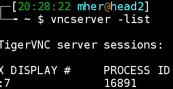
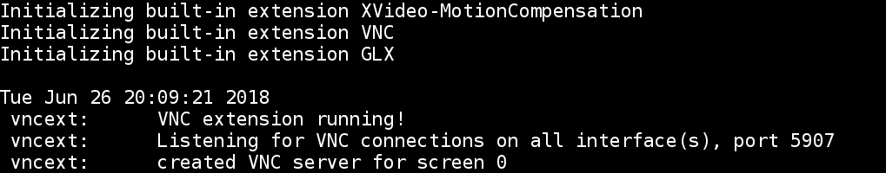
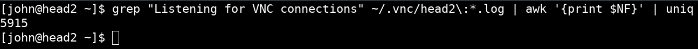
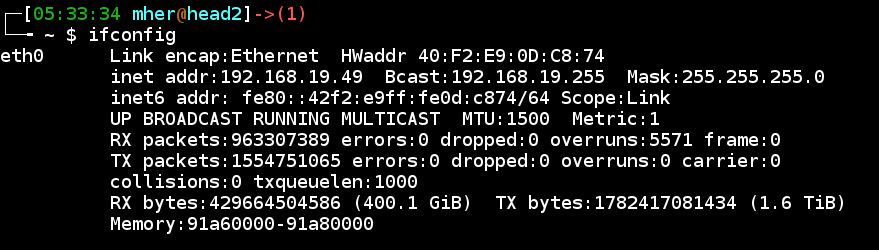
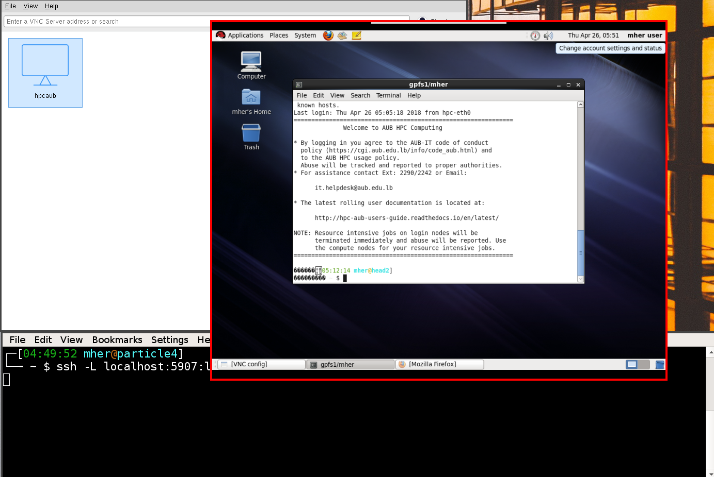

Getting connected
-----------------
.. _Getting_started_arza:

Connecting to a terminal
========================

When on the AUB network (also valid when connected through the VPN service
https://servicedesk.aub.edu.lb/TDClient/Requests/ServiceDet?ID=29740 ),
any of the following mehtod can be used to login to the head node of the cluster.

.. code-block:: bash

    ssh my_user_name@hpc.aub.edu.lb       # preffered
    ssh my_user_name@head2.aub.edu.lb     # optional  (when on AUB VPN network)
    ssh my_user_name@head1.aub.edu.lb     # optional  (when on AUB VPN network)
    ssh my_user_name@192.168.19.49        # last resort (if all of the above do not work)

TIP: Passwordless login can be set up to avoid typing the password everytime and
     is safer than saving the password in the ssh client or re-tying it.

.. warning:: SECURITY: make sure to change your account password after the
 administrators have created your account. To change the account password
 after logging in, use the command ``passwd``

.. note:: if ``hpc.aub.edu.lb`` does not work (due to, e.g. name resolution)
 use ``head2.aub.edu.lb``. This applies to the rest of the user guide as well.

Tools for connecting
====================

- native ssh on linux or mac (recommended)
- msys2: https://www.msys2.org/ (recommended on windows)
- mobaxterm (most user freindly): https://mobaxterm.mobatek.net/
    .. note:: install the portable version, it does not require admin access
- winscp: https://winscp.net/eng/index.php
- putty: https://putty.org/

Generating a ssh private-public key pair
========================================

SSH keys can be used to authenticate yourself to login to the cluster. This is
the recommended method and is more secure than typing in password or saving
the passowrd in the ssh client (e.g putty). The generated key pair will allow
you to login to the cluster from your local machine.

.. code-block:: text

       my machine         ---------->    HPC cluster
       (linux/win/mac)                   (linux)

on linux and mac
^^^^^^^^^^^^^^^^

To generate the key files:

   - public key : ``~/.ssh/id_rsa.pub``
   - private key: ``~/.ssh/id_rsa``

execute the following command in a termanl on you machine:

.. code-block:: bash

    # first generate an ssh key on A
    my machine> ssh-keygen -t rsa -b 4096

.. warning:: this will overwrite any keys that already exist. You can specify
 a new identity name using the ``-f my_ouptut_keyfie``

.. note:: this same process can be done on windows also from the command line
 assuming that you already have openssh installed. (e.g using ``msys2``)

<`screencast <http://website.aub.edu.lb/it/hpc/SiteAssets/Pages/faq/generate_ssh_key_linux.mp4>`_>

on windwows using mobaxterm
^^^^^^^^^^^^^^^^^^^^^^^^^^^

``Mobaxterm`` can be used to generate a ssh private-public key pair.
<`screencast <http://website.aub.edu.lb/it/hpc/SiteAssets/Pages/faq/generate_ssh_public_private_key_pair_mobaxterm_windows_and_enable_passwordless_login.mp4>`_>

Login to the HPC cluster using a ssh public key
===============================================

At this point, it is assumed that you already have a ssh identity
(public-private key pair). If not, see the section above.

on linux/mac
^^^^^^^^^^^^

to push you public key to the cluster, the command ``ssh-copy-id`` can be
used.

.. code-block:: bash

    $ ssh-copy-id -i id_rsa john@hpc.aub.edu.lb

To test if the key has been added correctly:

.. code-block:: bash

    $ ssh -i ~/.ssh/id_rsa john@hpc.aub.edu.lb

<`screencast <http://website.aub.edu.lb/it/hpc/SiteAssets/Pages/faq/login_with_ssh_key_linux.mp4>`_>

on windows using mobaxterm
^^^^^^^^^^^^^^^^^^^^^^^^^^

The second part of the following `screencast <http://website.aub.edu.lb/it/hpc/SiteAssets/Pages/faq/generate_ssh_public_private_key_pair_mobaxterm_windows_and_enable_passwordless_login.mp4>`_ covers using mobaxterm and a ssh
identity to log in without a password.

Connecting to a graphical user interface
========================================

VNC session are useful only if you want to have a desktop like environment on
the HPC cluster displayed on your computer. Such desktop environments are useful
for example for lightweight visualizations of data that are on the HPC cluster or
for testing and prototyping. In this section the procedure for creating a VNC
session on the head node is described.

.. note::

   VNC session on the head node should be restricted for non-compute or memory or input/output
   intensive tasks. For demanding interative work with a desktop environment use the job script
   for running a VNC server on a :ref:`compute node <interactive_job_arza_anchor>` that has
   signifincantly more resources than the head node and significantly more rendering power on
   the GPU nodes.

VNC session are not needed for command line work or for running batch batch.

VNC clients
^^^^^^^^^^^

VNC is a simple way to join a remote desktop session on the cluster. There
are several flavours and clients of VNC. We recommend the following:

   - realVNC: https://www.realvnc.com/en/connect/download/viewer/linux/  (easy)
   - TigerVNC: https://wiki.archlinux.org/index.php/TigerVNC             (easy-advanced)

TigerVNC can be easily installed on most linux operating systems. RealVNC
is more user freindly and is available on most common operating systems.

Creating SSH tunnels
====================

SSH tunnels are handy for redirecting traffic from one host/port to another.
Here are some links on how to create tunnels on various platfroms, since we
will be using them in what follows:

  - native linux tunnel https://www.revsys.com/writings/quicktips/ssh-tunnel.html
  - tunnels with putty
        + https://infosecaddicts.com/perform-local-ssh-tunneling/
        + https://www.youtube.com/watch?v=7YNd1tFJfwc
  - tunnels with powershell https://www.youtube.com/watch?v=gh03CpaUxbQ
  - tunnels with mobaxterm
        + https://blog.mobatek.net/post/ssh-tunnels-and-port-forwarding/
        + http://emp.byui.edu/ercanbracks/cs213/SSH%20tunneling%20with%20Mobaxterm.htm
  - contact it.helpdesk and mention ``HPC getting connected``

Create a VNC session
^^^^^^^^^^^^^^^^^^^^

To connect to a remote session, a vnc server must be already running on the
the HPC cluster. This can be done once by logging through the command line
and executing the command:

.. code-block:: bash

       vncserver

When the session is created, a similiar output to this screenshot is shown
on the terminal

.. figure:: imgs/vnc_session_create.png
   :scale: 50 %
   :alt:

Set a password to the new vnc session (otherwise anyone can connect to your
vnc session).

.. code-block:: bash

        vncpasswd

To make sure that the server has started, the list of running VNC server can
be obtained through:

.. code-block:: bash

       vncserver -list

keep note of the process ID (VNCPID) of the vnc server. We will assume it is
VNCPORT. The default port number if 5900, but if this port is already used,
the port number will be different.

Find the port number of a certain VNC session
^^^^^^^^^^^^^^^^^^^^^^^^^^^^^^^^^^^^^^^^^^^^^

The port number is needed to create a SSH tunnel to the head node (where the
VNC server session is running). There are two ways to get the ``port`` number
of the VNC session.

For every VNC session there is an associated ``.log`` file. In the screenshot
above, there is one VNC session running, ``:7``. The log file of session ``:7``
is the file ``~/.vnc/head2:7.log``. Each user gets a different session number,
The log file of session ``:NNN`` is the file ``~/.vnc/head2:NNN.log``.

To find the port number, search for the line

    ``vncext: Listening for VNC connections on all interface(s), port 5907``

see the following screenshot.

Another way of getting the ``port`` number is using the command ``netstat``.
To find the port number of the session we want to connect to, execute

.. code-block:: bash

      netstat -tnlp | grep VNCPID

.. figure:: imgs/vnc_netstat.png
   :scale: 50 %
   :alt:

In this case the ``VNCPORT`` is ``5907`` (the first line in the screenshot).

.. warning:: make sure to set secure a password to the VNC session. This can
 be set to anything irrespective of the login password.

Obtain the port number from ``~/.vnc/head:X.log`` file
++++++++++++++++++++++++++++++++++++++++++++++++++++++

The port number is also logged to ``~/.vnc/head:X.log``, there might be several
``.log`` files in ``~/.vnc``, but usually a user gets assigned always the same
port number. Executing the following command will display one (or more) port
numbers. Try them out until one works (agian, usually there should be one
number). If all fails, kill the ``vncserver`` and delete the
``~/.vnc/head:*.log`` and re-create a vncserver.

.. code-block:: bash

      grep "Listening for VNC connections" ~/.vnc/head2\:*.log | awk '{print $NF}' | uniq

Create the ssh tunnel
^^^^^^^^^^^^^^^^^^^^^

Once the port (VNCPORT) is known, create a ssh tunnel by local port forwarding
to the bound port on the HPC cluster. On a terminal on your local machine
(i.e the machine where the vnc viewer/client will run)

.. code-block:: bash

    ssh -L localhost:VNCPORT:localhost:VNCPORT my_user_name@hpc.aub.edu.lb -N

It is recommended to use the actual IP address of the node where the vnc server
is running since the ``VNCPORT`` would most likely be closed when connected
through the VPN. An actual example could look like:

.. code-block:: bash

    ssh -L localhost:5907:localhost:5907 my_user_name@hpc.aub.edu.lb

The IP address of the HPC node where the server is running can be obtaine with
``ifconfig``

Once the tunnel is created, the vnc client can be used to connect to the desktop
session that is running on the HPC cluster (head node). In the example below
we will use ``realvnc``

.. figure:: imgs/vnc3.png
   :scale: 50 %
   :alt:

After creating the vnc connection (icon) you can connect by double clicking
on the shortcut icon.

There are several options that can be set in the file ``~/.vnc/xstartup``
that allow for customized in the graphical session.
