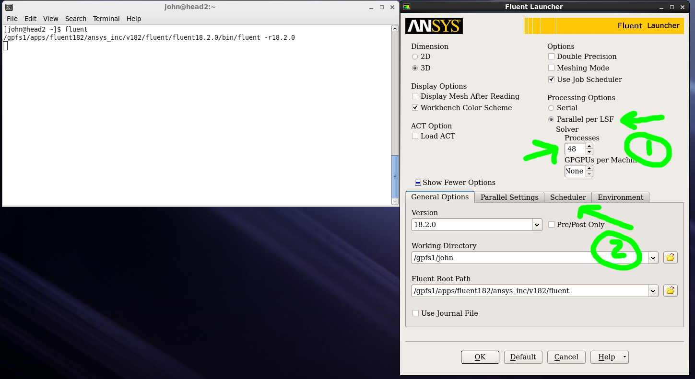

The Ansys Flutent environment
=============================

Overview
^^^^^^^^

In-order to use ``Ansys Flutent`` a ``VNC`` session is need. Execution can be
done in batch mode, but that is beyond the scope of this guide. To login to a
``VNC`` have a look at the getting connection documentation
:ref:`here <VNC clients>`.

To run ``Fluent`` the user has two options:

   - :ref:`Start an interactive batch job and use Fluent on one compute node <fluent_single_node>`
   - :ref:`Instruct Fluent to run in parallel by using the scheduler <fluent_multi_node>`

In both cases the Ansys Fluent module must be loaded

.. code-block:: bash

     $ module load ansys/fluent/18.2

Running Ansys Fluent on a single node
-------------------------------------
.. _fluent_single_node:

In this configuration, Fluent can be run either in ``serial`` mode (one core) or
in parallel mode using up to the max number of cores and all the available
memory of a compute node.

Start by allocating an interactive job with X forwarding and execute the command
``fluent``

Fluent in ``serial`` mode
+++++++++++++++++++++++++

To run ``Fluent`` in serial mode, execute:

.. code-block:: bash

   bsub -n 1 -XF -I fluent

that launches the ``Fluent`` launcher

.. image:: fluent/fluent_serial.png
   :scale: 100 %
   :align: center

Fluent in ``parallel`` mode
+++++++++++++++++++++++++++

To run ``Fluent`` in parallel mode on a single node, execute:

.. code-block:: bash

   bsub -n 16 -XF -I fluent

that launches the ``Fluent`` launcher

.. image:: fluent/fluent_parallel_single_node.png
   :scale: 100 %
   :align: center

After the Fluent "launcher" is displayed, set the number of ``Processes`` to
the same number used in the ``bsub`` command (see screenshot above)

.. _fluent_multi_node:

Configure Ansys Fluent to run in parallel
-----------------------------------------

For simulations that do not fit in a single node, ``Fluent`` can automatically
allocate resources on multiple nodes. In this case the following steps must be
followed:

- use the command ``fluent`` on the terminal to open the ``Fluent`` launcher
- tick ``Use Job Scheduler`` and specify the number of cores to use

- in the ``Scheduler`` tab select the queue to be used. The ``bqueues`` command
 can be used to see the available queues. These queues are also described in the
 `HPC usage policy <http://website.aub.edu.lb/it/hpc/SiteAssets/Pages/contact-us/HPC_Usage_Policy_v2.pdf>`_.

.. image:: fluent/fluent_multi_node_2.png
   :scale: 100 %
   :align: center
