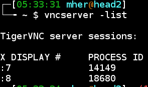
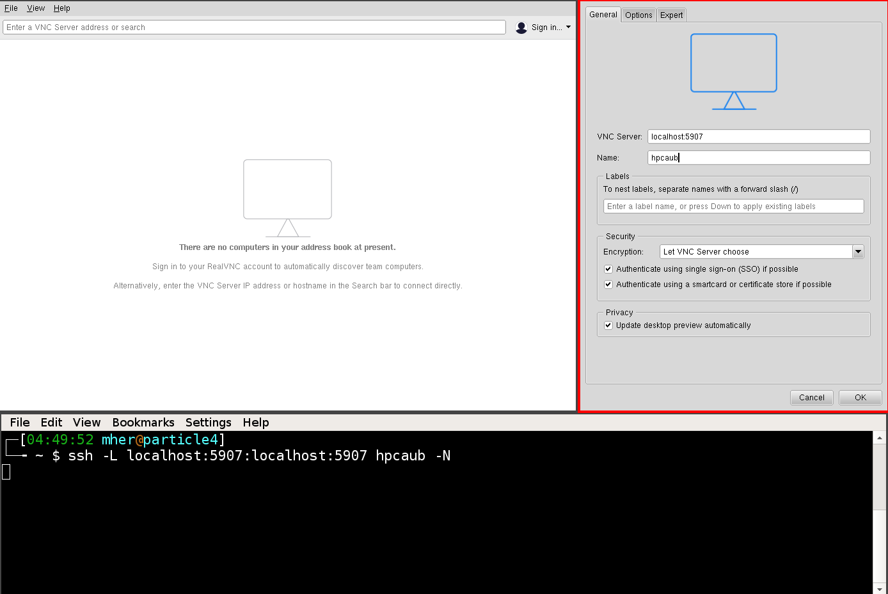

Getting connected
-----------------

Connecting to a terminal
========================

When on the AUB network (also valid when connected through the VPN service
https://website.aub.edu.lb/it/services/staff/configs/sslvpn/Pages/index.aspx),
any of the following mehtod can be used to login to the head node of the cluster.

.. code-block:: bash

    ssh my_user_name@hpc.aub.edu.lb       # preffered
    ssh my_user_name@head2.aub.edu.lb     # optional
    ssh my_user_name@head1.aub.edu.lb     # optional
    ssh my_user_name@192.168.19.49        # not recommended

TIP: Passwordless login can be set up to avoid typing the password everytime.

Connecting to a graphical user interface
========================================

VNC is a simple way to join a remote desktop session on the cluster. There
are several flavours and clients of VNC. We recommend the following:

   - realVNC: https://www.realvnc.com/en/connect/download/viewer/linux/  (easy)
   - TigerVNC: https://wiki.archlinux.org/index.php/TigerVNC             (easy-advanced)

TigerVNC can be easily installed on most linux operating systems. RealVNC
is more user freindly and is available on most common operating systems.

To connect to a remote session, a vnc server must be already running on the
the HPC cluster. This can be done once by logging through the command line
and executing the command:

.. code-block:: bash

       vncserver

To make sure that the server has started, the list of running VNC server can
be obtained through:

.. code-block:: bash

       vncserver -list

keep note of the process ID (VNCPID) of the vnc server. We will assume it is
VNCPORT. The default port number if 5900, but if this port is already used,
the port number will be different.

What is relevant the most is the ``port`` at which the server is running. e.g
to find the port number of the session we want to connect to, execute

.. code-block:: bash

      netstat -tnlp | grep VNCPID

.. figure:: imgs/vnc1.png
   :scale: 50 %
   :alt:

.. warning:: make sure to set secure a password to the VNC session. This can
 be set to anthing irrespective of the login password.

Once the port (VNCPORT) is known, create a ssh tunnel by local port forwarding
to the bound port on the HPC cluster. On a terminal on your local machine
(i.e the machine where the vnc viewer/client will run)

.. code-block:: bash

    ssh -L localhost:VNCPORT:localhost:VNCPORT my_user_name@hpc.aub.edu.lb

It is recommended to use the actual IP address of the node where the vnc server
is running since the VNCPORT would most likely be closed when connected
through the VPN. An actual example could look like:

.. code-block:: bash

    ssh -L localhost:5907:localhost:5907 mk250@192.168.19.49

The IP address of the HPC node where the server is running can be obtaine with
``ifconfig``

.. figure:: imgs/ifconfig.png
   :scale: 50 %
   :alt:

Once the tunnel is created, the vnc client can be used to connect to the desktop
session that is running on the HPC cluster (head node). In the example below
we will use ``realvnc``

After creating the vnc connection (icon) you can connect by double clicking
on the shortcut icon.

.. figure:: imgs/vnc4.png
   :scale: 50 %
   :alt:

There are several options that can be set in the file ``~/.vnc/xstartup``
that allow for customized in the graphical session.

Connecting to a Jupyter-Lab notebook
====================================

Jupyter notebooks (http://jupyter.org/) are very handy for prototyping, testing
and running interactive computations in Python, R, C#, C++ and many other
languages https://github.com/jupyter/jupyter/wiki/Jupyter-kernels

To submit a job that runs a notebook server on one of the compute nodes,
the following job script can be used:

Assuming that there is already a vnc session running

.. literalinclude:: jupyter/job.sh
   :linenos:
   :language: bash

From lines 1 to 4 the job resource options are set (for more info on
using the scheduler click :ref:`here <_lsf_cheatsheet>`)

On the last two lines, the jupter notebook server is launched using port
38888 (this port number is arbitrary, any other available port can be used) and
in the last line, traffic to the port 38888 from the head node (head2) is
forwarded to the same port on the compute node.

After submitting the script, open a browser (e.g. firefox) on the head node
in your desktop of the vnc session and open the page

     http://localhost:38888

The access token can be found in the file ``jupyter.log`` in the job directory.

It is possible to set a fixed password or disable a password prompt.
Both are explained in http://jupyter-notebook.readthedocs.io/en/stable/public_server.html

.. note:: It is possible to connect to the jupyter server without a vnc session
 by using ssh tunnels. E.g:

      $ ssh -L localhost:38888:localhost:38888 hpcaub -N
