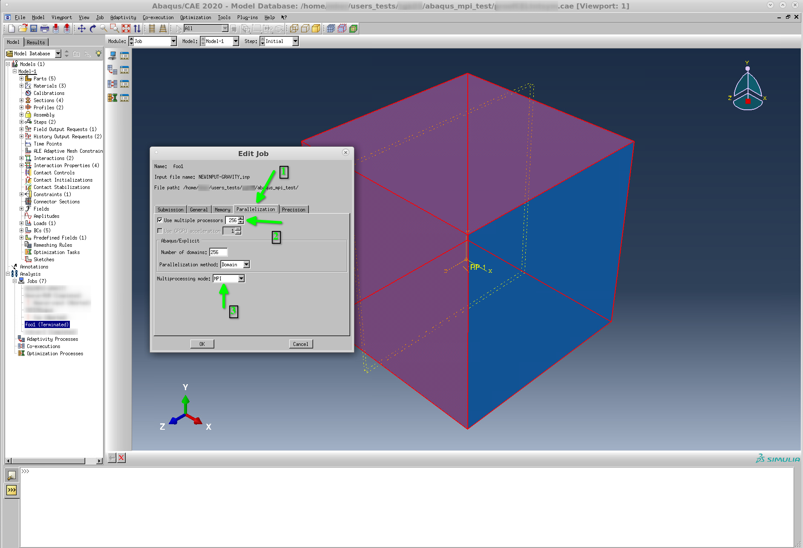

Abaqus
------

`Abaqus <https://www.3ds.com/products-services/simulia/products/abaqus/>`_ is an
application that is used for solving structural simulation of multi-physics problems.

There are two main modes of running Abaqus on Octopus:

  - batch mode (using the command line or scripts)
  - graphical user interface mode (using desktop sessions)

To use any of these two the ``abaqus`` module should be loaded:

.. code-block:: bash

     module load abaqus

Graphical user interface mode
^^^^^^^^^^^^^^^^^^^^^^^^^^^^^

To launch the ``Abaqus`` GUI after connecting to a desktop environment, to launch
``CAE`` (Complete Abaqus Environment) the following command can be executed in a
terminal:

.. code-block:: bash

    module load abaqus
    abaqus cae


Template Abaqus job (batch mode)
^^^^^^^^^^^^^^^^^^^^^^^^^^^^^^^^

The following job script can be used as a template to run ``abaqus`` batch jobs on
one compute node.

.. code-block:: bash

   #!/bin/bash

   ## specify the job and project name
   #SBATCH --job-name=abaqus
   #SBATCH --account=ab123

   ## specify the required resources
   #SBATCH --partition=normal
   #SBATCH --nodes=1
   #SBATCH --ntasks-per-node=1
   #SBATCH --cpus-per-task=16
   #SBATCH --mem=64000
   #SBATCH --time=1-00:00:00

   source ~/.bashrc
   module load abaqus/2020
   # module load intel/2021   # uncomment to load the intel compiler to build user subroutines
   abaqus job=my_abaqus_sim_name input=my_sim.inp cpus=`nproc` mp_mode=threads interactive

Multi-node parallel Abaqus jobs
^^^^^^^^^^^^^^^^^^^^^^^^^^^^^^^

The following job script :ref:`below <abaqus_multinode_mpi>` can be used to run a
parallel Abaqus job using multiple compute nodes in batch mode. The script below can be
downloaded by clicking :download:`here <abaqus/slurm_abaqus_mpi_job.sh>`

If a graphica user interface job is used then the following :download:`script <abaqus/slurm_abaqus_mpi_env_gen.sh>`
should be executed in the same folder where the command ``abaqus cae -mesa`` is executed:

.. code-block:: bash

     module load abaqus
     chmod +x slurm_abaqus_mpi_env_gen.sh
     ./slurm_abaqus_mpi_env_gen.sh
     abaqus cae -mesa

After the job is executed ``MPI`` must be selected in the the ``ABAQUS`` job in the GUI.




**script for running a multi-node parallel job in batch mode**

.. _abaqus_multinode_mpi:

.. code-block:: bash

   #!/bin/bash

   ## specify the job and project name
   #SBATCH --job-name=abaqus
   #SBATCH --account=ab123

   ## specify the required resources
   #SBATCH --partition=large
   #SBATCH --nodes=4
   #SBATCH --ntasks-per-node=1
   #SBATCH --cpus-per-task=64
   #SBATCH --mem=64000
   #SBATCH --time=1-00:00:00

   source ~/.bashrc
   module load abaqus/2020

   ##############################################################
   # DO NOT MODIFY BEYOND THIS UNLESS YOU KNOW WHAT YOU ARE DOING
   ##############################################################

   # dump the hosts to a text file
   SLURM_HOSTS_FILE=slurm-hosts-${SLURM_JOBID}.out

   #
   # generate the mp_host_list environment variable
   #
   srun hostname > ${SLURM_HOSTS_FILE}

   mp_host_list="["
   for HOST in `sort ${SLURM_HOSTS_FILE} | uniq`; do
       echo ${HOST}
       mp_host_list="${mp_host_list}""['${HOST}',`grep ${HOST} ${SLURM_HOSTS_FILE} | wc -l`]"
   done

   mp_host_list=`echo ${mp_host_list} | sed 's/\]\[/\]\,\[/g'`"]"

   echo $mp_host_list

   #
   # write the abaqus environment file
   #
   ABAQUS_ENV_FILE="abaqus_v6.env"
   cat > ${ABAQUS_ENV_FILE} << EOF
   import os
   os.environ['ABA_BATCH_OVERRIDE'] = '1'
   verbose=3
   mp_host_list=${mp_host_list}
   if 'SLURM_PROCID' in os.environ:
       del os.environ['SLURM_PROCID']
   EOF

   abaqus job=my_input_file.inp cpus=$SLURM_NPROCS` -verbose 3 standard_parallel=all mp_mode=mpi interactive


User defined subroutines and functions in Abaqus
^^^^^^^^^^^^^^^^^^^^^^^^^^^^^^^^^^^^^^^^^^^^^^^^

To define user subroutines and functions in Abaqus the following steps should be followed:

  #. Create the subroutine file (e.g. ``my_custom_constants.f``)
  #. Compile it to build a library
  #. Run the simulation using the compiled library

The ``.inp`` and the ``.f`` file should be in the same folder. It is possible
to organize them into different folders but the paths should be specified with
care (check the abaqus help and documentation for more information).

The following should exist in the directory of the simulation:

    * job.sh
    * my_simulation.inp
    * my_custom_constants.f
    * libstandardU.so             #   this is generated in step-2 below

Step-1: Create the subroutine file
""""""""""""""""""""""""""""""""""

The following example shows how to create a subroutine file (disclamer, this
subroutine does not do anything useful, please make sure to replace the content
with your own):

.. code-block:: fortran

          SUBROUTINE CREEP(DECRA,DESWA,STATEV,SERD,EC,ESW,P,QTILD,
         1 TEMP,DTEMP,PREDEF,DPRED,TIME,DTIME,CMNAME,LEXIMP,LEND,
         2 COORDS,NSTATV,NOEL,NPT,LAYER,KSPT,KSTEP,KINC)

          INCLUDE 'aba_param.inc'

          CHARACTER*80 CMNAME
          DIMENSION DECRA(*)

          DECRA(1) = 0.001 * DTIME

          RETURN
          END

Step-2: Compile the subroutine file
"""""""""""""""""""""""""""""""""""

The Intel compiler environment should be loaded since abaqus relies on Intel's
fortran compiler to build the libraries. The following command can be used to

.. code-block:: bash

    module load intel/2021
    $ abaqus make library=my_custom_constants.f

    [john@node ~]$ abaqus make library=foo.f
    Abaqus JOB foo.f
    Begin Compiling Abaqus/Standard User Subroutines
    Mon 13 May 2024 05:28:07 AM EEST
    Intel(R) Fortran Intel(R) 64 Compiler Classic for applications running on Intel(R) 64, Version 2021.2.0 Build 20210228_000000
    Copyright (C) 1985-2021 Intel Corporation.  All rights reserved.

     Intel(R) Fortran 2021.2.0-2262
    End Compiling Abaqus/Standard User Subroutines
    Begin Linking Abaqus/Standard User Subroutines
    Intel(R) Fortran Intel(R) 64 Compiler Classic for applications running on Intel(R) 64, Version 2021.2.0 Build 20210228_000000
    Copyright (C) 1985-2021 Intel Corporation.  All rights reserved.

    GNU ld version 2.27-34.base.el7
    End Linking Abaqus/Standard User Subroutines
    Mon 13 May 2024 05:28:13 AM EEST
    Abaqus JOB foo.f COMPLETED
```

The following file will be generated ``libstandardU.so`` that is automatically
picked up by abaqus when running the simulation.