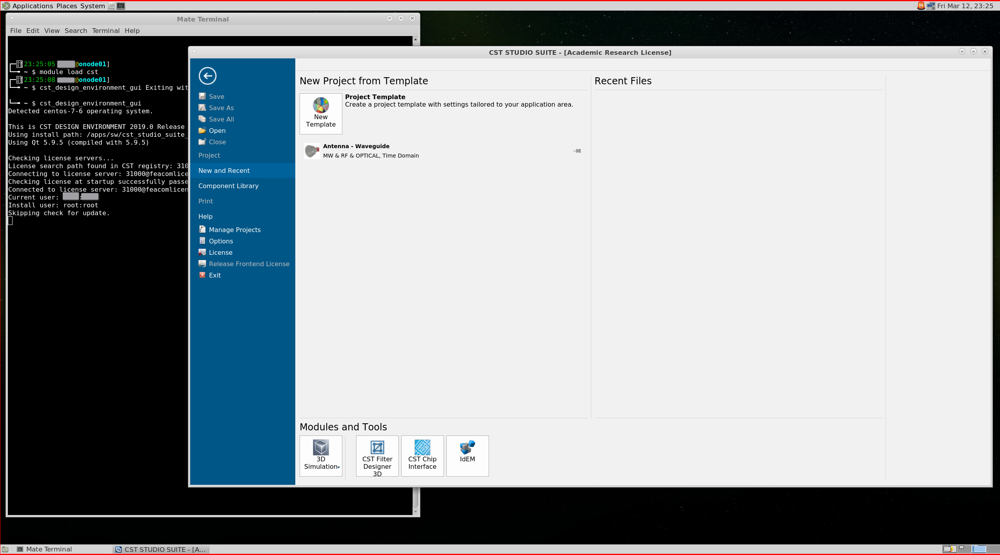

CST
---

To run CST in interactive (GUI) mode, a VNC job should be allocated.
Once the job runs and the connection to the VNC session through a VNC
client is done by the user, the following can be executed to start
CST GUI:

.. code-block:: bash

     module load cst/2019
     cst_design_environment_gui

The license server is:

.. code-block:: bash

      server: feacomlicense.win2k.aub.edu.lb
      port: 31000

Once the application runs, the opened application should look
similar to the following:

