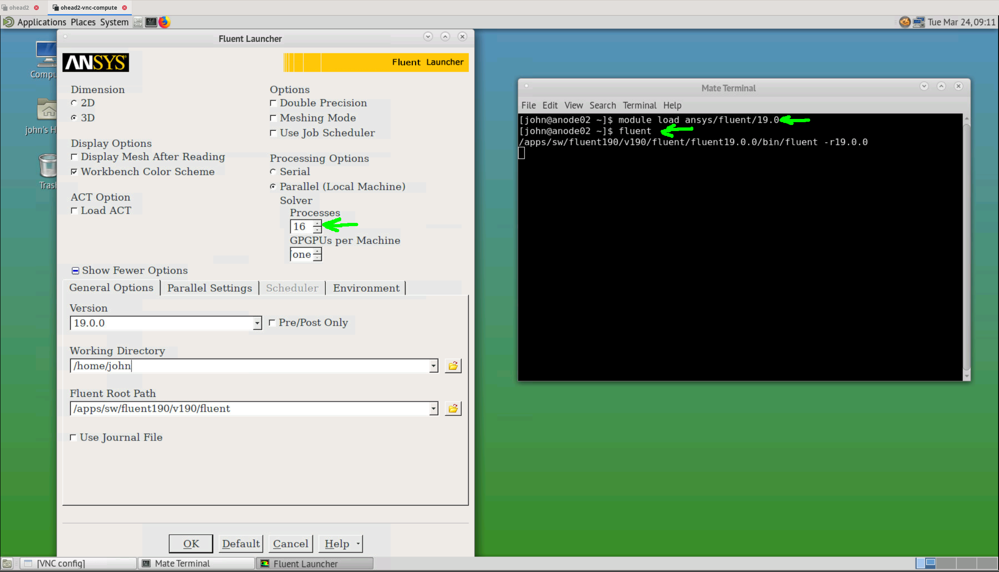
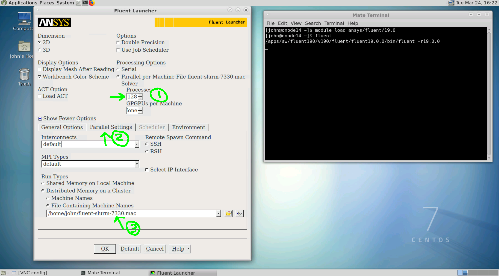

The Ansys Fluent environment
============================

Overview
^^^^^^^^

In-order to use ``Ansys Flutent`` a ``VNC`` session is need. Execution can be
done in batch mode, but that is beyond the scope of this guide.

There are three versions of fluent installed on ``octopus``:

   - 17.2
   - 18.2
   - 19.0

to load the latest version, the following command can be used in a terminal:

.. code-block:: bash

     $ module load ansys/fluent/19.0

Job script template
-------------------

.. _fluent_vnc_compute_node:

The following job script template can be used (for a ``VNC`` session):

.. code-block:: bash

    #!/bin/bash

    ## specify the job and project name
    #SBATCH --job-name=my_fluent_job
    #SBATCH --account=6544724

    ## specify the required resources
    #SBATCH --partition=normal
    #SBATCH --nodes=4
    #SBATCH --ntasks-per-node=8
    #SBATCH --cpus-per-task=1
    #SBATCH --mem=64000
    #SBATCH --time=0-06:00:00

    ### DO NOT EDIT BEYOND HERE UNLESS YOU KNOW WHAT YOU ARE DOING
    source ~/.bashrc

    VNC_HEAD_PORT=$(random_unused_port)
    echo "VNC_HEAD_PORT = ${VNC_HEAD_PORT}"

    JOB_INFO_FPATH=~/.vnc/slurm_${SLURM_JOB_ID}.vnc.out
    rm -f ${JOB_INFO_FPATH}

    VNC_SESSION_ID=$(vncserver 2>&1 | grep "desktop is" | tr ":" "\n" | tail -n 1)
    echo ${VNC_SESSION_ID} >> ${JOB_INFO_FPATH}

    ssh -R localhost:${VNC_HEAD_PORT}:localhost:$((5900 + ${VNC_SESSION_ID})) ohead1 -N &
    SSH_TUNNEL_PID=$!
    echo ${SSH_TUNNEL_PID} >> ${JOB_INFO_FPATH}

    slurm_hosts_to_fluent_hosts

    sleep infinity

Running Ansys Fluent
--------------------

Fluent in shared memory mode
++++++++++++++++++++++++++++

.. _fluent_shared_memory_mode_octopus:

In this configuration, Fluent can be run either in ``serial`` mode (one core) or
in shared memory (SMP) mode using up to the max number of cores and all the available
memory of a compute node.

To run ``Fluent`` in local mode using one or multiple cores on the same machine, execute:

.. code-block:: bash

    $ module load ansys/fluent/19.0
    $ fluent

in a terminal, the ``Fluent`` launcher should open in the desktop

.. note:: use ``#SBATCH --nodes=1`` in the job script.

Fluent in distributed mode
++++++++++++++++++++++++++

For simulations that do not fit in a single node, ``Fluent`` can automatically
allocate resources on multiple nodes. In this case the following steps must be
followed:

 - open the ``fluent`` laucher in the same procedure done for shared memory mode
 - select the number of cores (step 1 in the figure below)
 - click on the ``Parallel Settings`` tab (step 2 in the figure below)
 - set the ``File Containing Machine Names`` (step 3 in the figure below). Each
   job will have a different file name that is prefix by the slurm job id.

.. note:: For example to use four nodes use ``#SBATCH --nodes=4`` in the job
 script to use for node. To run a simulation on 128 cores you can use:

   - ``#SBATCH --nodes=4`` and ``#SBATCH --ntasks-per-node=32``, this will allow
     you to use up to 1024 GB ram.
   - ``#SBATCH --nodes=2`` and ``#SBATCH --ntasks-per-node=64`` will grant you
     access to 512 GB ram.

