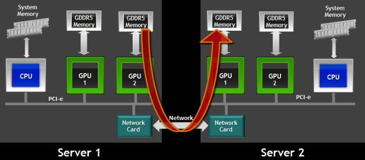

GPU computing
-------------

Running GPU applications
^^^^^^^^^^^^^^^^^^^^^^^^

Profiling GPU applications
^^^^^^^^^^^^^^^^^^^^^^^^^^

Multi-GPU Multi-host GPU applications
^^^^^^^^^^^^^^^^^^^^^^^^^^^^^^^^^^^^^

GPUs can be spread across several servers. As long as they can communicate with each other
then these GPUs can be used together just like :ref:`multi-CPU multi-host <mpi_parallel_applications_general>`
parallel processing is done.

The following diagram shows a multi-host multi-GPU design that can be used to run GPU-to-GPU
parallel computing using MPI.

The following git repository contains examples of multi-GPU programming models:
https://github.com/NVIDIA/multi-gpu-programming-models.git

Below is a job script that can be used to run the basic MPI example
https://github.com/NVIDIA/multi-gpu-programming-models/tree/master/mpi

.. code-block:: bash

    #!/bin/bash

    #SBATCH --job-name=jacobi-multi-gpu-cuda
    #SBATCH --nodes=2
    #SBATCH --partition=normal
    #SBATCH --ntasks-per-node=1
    #SBATCH --cpus-per-task=1
    #SBATCH --mem=8000
    ##SBATCH --gres=gpu:v100d8q:1
    #SBATCH --time=0-01:00:00

    module load mpi/openmpi/4.1.4-slurm-18.08.6-cuda-12.4
    module load gcc/9.1.0
    module load prun
    module load pmix

    srun --mpi=mpix ./jacobi