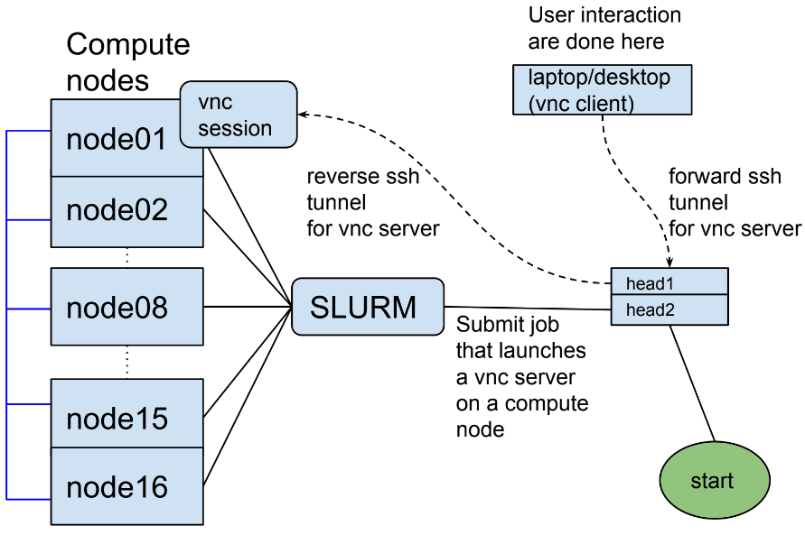

Interactive jobs
----------------

.. _interactive_job_octopus_anchor:

Summary
^^^^^^^

To connect to a vnc session on a compute node:

  - submit the job script shown below
  - create a ssh tunnel from your machine to the head node of the cluster
  - connect using a vnc viewer (client) to the ssh tunnel on localhost

An interactive job on a compute node
++++++++++++++++++++++++++++++++++++

Interactive jobs are useful for simulations that require human intervention
or monitoring. When the job script is submitted a vnc session is created on
the compute node, the session is terminated when the job exits or is killed.

To connect to the vnc session using a vnc viewer (client) a tunnel to the
``VNC_HEAD_PORT`` that is specified in the job script below should be created.

caveates
^^^^^^^^

  - ``VNC_HEAD_PORT`` is not used by any user on the head node an is available

The following job script can be used as a template and the resources options
can be changed to meet the demands of a particular simulation

.. code-block:: bash

    #!/bin/bash

    ## specify the job and project name
    #SBATCH --job-name=my_job_name
    #SBATCH -A foo_project

    ## specify the required resources
    #SBATCH --partition normal
    #SBATCH --nodes=1
    #SBATCH --ntasks-per-node=1
    #SBATCH --cpus-per-task=1
    #SBATCH --mem=12000
    #SBATCH --time=0-01:00:00

    # cleanup vnc session and reverse ssh tunnel after job exits (or is killed)
    # do not edit these BSUB flags beyond here
    #BSUB -Ep "vncserver -kill :$(sed -n '1p' < ~/.vnc/lsf_${LSB_JOBID}.vnc.out)"
    #BSUB -Ep "kill -9 $(sed -n '2p' < ~/.vnc/lsf_${LSB_JOBID}.vnc.out)"
    #BSUB -Ep "rm -f ~/.vnc/lsf_${LSB_JOBID}.vnc.out"

    # change this port number to something that is available on the head node
    VNC_HEAD_PORT=59008

    ### DO NOT EDIT BEYOND HERE UNLESS YOU KNOW WHAT YOU ARE DOING
    JOB_INFO_FPATH=~/.vnc/slurm_${LSB_JOBID}.vnc.out
    rm -f ${JOB_INFO_FPATH}

    VNC_SESSION_ID=$(vncserver 2>&1 | grep "desktop is" | tr ":" "\n" | tail -n 1)
    echo ${VNC_SESSION_ID} >> ${JOB_INFO_FPATH}

    ssh -R localhost:${VNC_HEAD_PORT}:localhost:$((5900 + ${VNC_SESSION_ID})) octopus.aub.edu.lb -N &
    SSH_TUNNEL_PID=$!
    echo ${SSH_TUNNEL_PID} >> ${JOB_INFO_FPATH}

    sleep infinity

mkdir ~/.vnc

add the following to ~/.vnc/config

securitytypes=vncauth
desktop=sandbox
geometry=1900x1000
dpi=120
localhost
alwaysshared

then execute

chmod 644 ~/.vnc/config

add the following to ~/.vnc/xstartup

#!/bin/sh

unset DBUS_SESSION_BUS_ADDRESS
[ -x /etc/vnc/xstartup ] && exec /etc/vnc/xstartup
[ -r $HOME/.Xresources ] && xrdb $HOME/.Xresources
xsetroot -solid grey
vncconfig -iconic &
x-terminal-emulator -geometry 80x24+10+10 -ls -title "$VNCDESKTOP Desktop" &
mate-session &

chmod +x ~/.vnc/xstartup
