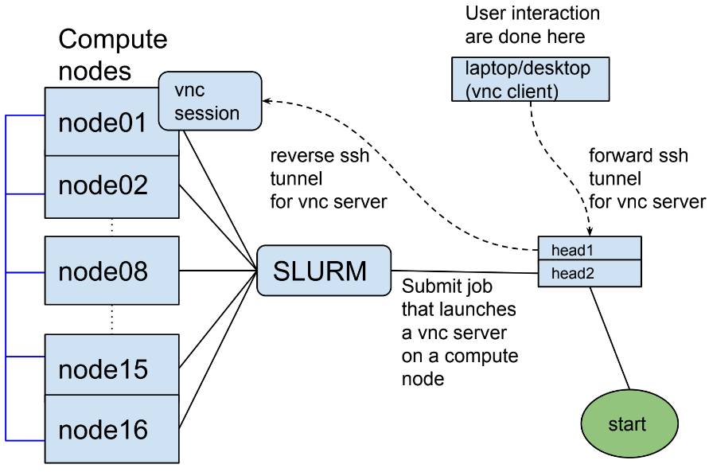

Interactive jobs - Desktop environment on a compute nodes
---------------------------------------------------------

.. _interactive_job_octopus_anchor:

Interactive jobs give the user a desktop like environment on a compute node.
Such jobs are useful for tasks where user interactions / input are needed.
For example, although ``matlab`` or ``Ansys Fluent`` jobs can be run as
batch jobs through the command line or scripts, sometimes interacting with their
GUIs is necessary.

Prerequisites
+++++++++++++

For Windows, download the portable version of `RealVNC Viewer <https://www.realvnc.com/en/connect/download/viewer/?lai_vid=8rVE8Wk8DfRz&lai_sr=0-4&lai_sl=l#>`_.
The portable version does not require admin rights to run.

Recommended workflow
++++++++++++++++++++

   1) :ref:`Create the VNC configuration <create_vnc_configuration>`. This step is
      done when the account is created and hence can be skipped. Execute the procedure
      described there if your VNC configuration does not exist or is corrupted.
   2) :ref:`submit the job script <submit_vnc_job>` ( e.g ``sbatch job.sh``)
   3) Get the port number after the job starts running from e.g slurm-166866.out get the VNC port number ``VNC_HEAD_PORT = 5201``.
   4) :ref:`create the tunnel <create_vnc_tunnel>`.
   5) connect using a vnc viewer to the vnc session running on the compute using e.g ``localhost:5201``

An interactive job on a compute node
++++++++++++++++++++++++++++++++++++

When the interactive job script is submitted, a vnc session is created on
the compute node. The session is terminated when the job exits or when the job
is killed.

To connect to the vnc session using a vnc viewer (client) a tunnel to the
``VNC_HEAD_PORT`` that is specified in the job script below should be created.

details
^^^^^^^^

Create/edit folder and files
++++++++++++++++++++++++++++
.. _create_vnc_configuration:

- first check if the folder ``.vnc`` exists and has the following two files:
  ``xstartup`` and ``config`` by executing:

  .. code-block:: bash

       ls ~/.vnc

  the output should show

  .. code-block:: bash

       config  xstartup

  If these files don't exist, create them by copying the settings from a
  pre-defined directory on the shared filesystem ``/home/shared/sample_scripts/slurm_vnc_job``

  .. code-block:: bash

        rm -fvr ~/.vnc
        cp -fvr /home/shared/sample_scripts/slurm_vnc_job/.vnc ~/
        chown -Rc $USER ~/.vnc
        cp /home/shared/sample_scripts/slurm_vnc_job/job.sh ~/

  set the vnc password by executing the command (set a strong password that is
  at least 12 characters long)

  .. code-block:: bash

        vncpasswd
        # optionally set a view only password

submit the job
++++++++++++++
.. _submit_vnc_job:

The following job script can be used as a template and the resources options
can be changed to meet the demands of a particular simulation. This job
script is also included in ~/.vnc folder. After submitting the job, the
``VNC_HEAD_PORT`` is written to the ``slurm-JOBID.out`` file.

    .. code-block:: bash

        #!/bin/bash

        ## specify the job and project name
        #SBATCH --job-name=my_job_name
        #SBATCH --account=abc123

        ## specify the required resources
        #SBATCH --partition=normal
        #SBATCH --nodes=1
        #SBATCH --ntasks-per-node=1
        #SBATCH --cpus-per-task=8
        #SBATCH --mem=4000
        #SBATCH --time=0-01:00:00
        #SBATCH --mail-type=ALL
        #SBATCH --mail-user=abc123@mail.aub.edu

        ### DO NOT EDIT BEYOND HERE UNLESS YOU KNOW WHAT YOU ARE DOING
        source ~/.bashrc

        VNC_HEAD_PORT=$(random_unused_port)
        echo "VNC_HEAD_PORT = ${VNC_HEAD_PORT}"

        JOB_INFO_FPATH=~/.vnc/slurm_${SLURM_JOB_ID}.vnc.out
        rm -f ${JOB_INFO_FPATH}

        VNC_SESSION_ID=$(vncserver 2>&1 | grep "desktop is" | tr ":" "\n" | tail -n 1)
        echo ${VNC_SESSION_ID} >> ${JOB_INFO_FPATH}

        ssh -R localhost:${VNC_HEAD_PORT}:localhost:$((5900 + ${VNC_SESSION_ID})) ohead1 -N &
        SSH_TUNNEL_PID=$!
        echo ${SSH_TUNNEL_PID} >> ${JOB_INFO_FPATH}

        sleep infinity

A copy of this file can be obtained from ``/home/shared/sample_scripts/slurm_vnc_job/job.sh``.
Altenatively create the file in your ``~/`` directory. The script can be submitted
the usual way using ``sbatch``.

.. code-block::bash

    $ sbatch job.sh

Create a ssh tunnel
+++++++++++++++++++

.. _create_vnc_tunnel:

On a **local** terminal, use the ``VNC_HEAD_PORT`` written to the ``slurm-JOBID.out``
file to create the tunnel. The tunnel can be created using other application such
as ``mobaxterm`` using its `graphical user interface <https://blog.mobatek.net/post/ssh-tunnels-and-port-forwarding/>`_.

.. code-block:: bash

   ssh -L localhost:<VNC_HEAD_PORT>:localhost:<VNC_HEAD_PORT> <user>@octopus.aub.edu.lb -N

Connect using a vnc viewer (client) to the ssh tunnel on localhost
++++++++++++++++++++++++++++++++++++++++++++++++++++++++++++++++++

If you're using RealVNC type in ``localhost:<VNC_HEAD_PORT>``

or on MobaXterm, ``session -> VNC``:

   - Remote hostname or IP address: ``localhost``
   - port: ``<VNC_HEAD_PORT>``

Using novnc in the browser
++++++++++++++++++++++++++

The process for using noVNC in the browser is similar to using a VNC viewer but simpler. The noVNC
approach does not require downloading the VNC client software. Instead, it allows you to access
the VNC session directly from a web browser.

Workflow
++++++++

   1) :ref:`Create the VNC configuration <create_novnc_configuration>`. [one time] This step is
      done when the account is created and hence can be skipped. Execute the procedure
      described there if your VNC configuration does not exist or is corrupted.
   2) :ref:`submit the job script <submit_novnc_job>` ( e.g ``/home/shared/sample_scripts/slurm_vnc_job/novnc_slurm_job.sh``)
      or copy it from below, edit it to change the resources options and submit it using ``sbatch``.
   3) After the job start check the output slurm file, the content should be similar to the following:

      .. code-block:: bash

         sourced .bashrc-prompt
         VNC_HEAD_PORT = 3091
         NOVNC_HEAD_PORT = 3092
         vnc session 5 is running on VNC port 5905
         novnc listen port 6085
         create the ssh tunnel to the web UI with
            ssh -L 3092:localhost:3092 abc123@octopus.aub.edu.lb -N
         use the following url to access the desktop via novnc:
            http://localhost:3092/vnc.html
         going to sleep indefinitely to keep the job alive...
   4) create the tunnel by pasting the ssh command above in your terminal (e.g bash or cmd)`.
      for every job the port number is different, so make sure to copy/paste the content of the
      output of the slurm job.

      .. code-block:: bash

         ssh -L YOUR_PORT:localhost:YOUR_PORT abc123@octopus.aub.edu.lb -N
         #in the example above, YOUR_PORT is 3092 and the command is
         ssh -L 3092:localhost:3092 abc123@octopus.aub.edu.lb -N

   5) connect to the session by pasting the url in your web browser (e.g chrome, firefox, edge).
      For every job the port number is different, so make sure to copy/paste the content of the
      output of the slurm job.

      .. code-block:: bash

         http://localhost:YOUR_PORT/vnc.html
         #in the example above, YOUR_PORT is 3092 and the url is
         http://localhost:3092/vnc.html

Submit the job
++++++++++++++
.. _submit_novnc_job:

The following job script can be used as a template and the resources options
can be changed to meet the demands of a particular simulation. This job
script is also included in ~/.vnc folder. After submitting the job, the
``VNC_HEAD_PORT`` is written to the ``slurm-JOBID.out`` file.

    .. code-block:: bash

      #!/bin/bash

      #SBATCH --job-name=novnc
      #SBATCH --account=abc123

      ## specify the required resources
      #SBATCH --partition=normal
      #SBATCH --nodes=1
      #SBATCH --ntasks-per-node=1
      #SBATCH --cpus-per-task=4
      #SBATCH --mem=4000
      #SBATCH --time=0-01:00:00
      #SBATCH --mail-type=ALL
      #SBATCH --mail-user=abc123@mail.aub.edu

      /home/shared/sample_scripts/slurm_vnc_job/vnc_novnc_wrapper.sh
