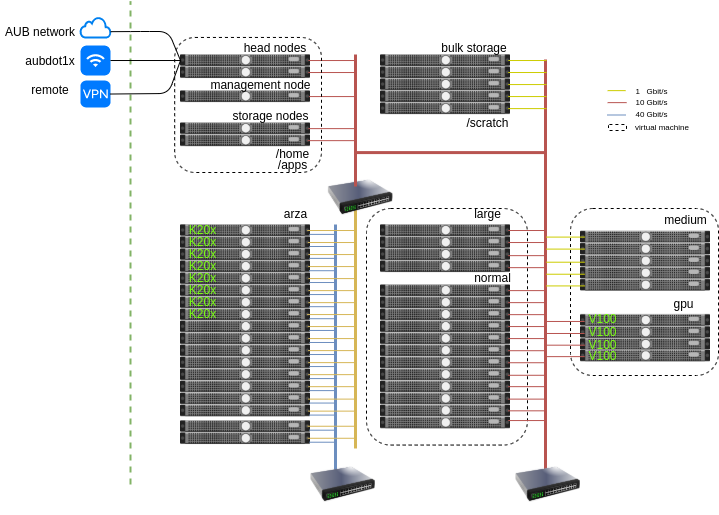

Overview
---------

Hardware Resources
==================

``Octopus`` is a mixed architecture Intel/AMD Beowulf cluster with the
following specifications:

   - 832 cores on 43 compute nodes (424 on Intel hosts and 408 on AMD hosts) with the following processors:
        + `AMD EPYC 7551p <https://www.amd.com/en/support/downloads/drivers.html/processors/epyc/epyc-7001-series/amd-epyc-7551p.html>`_
        + `Intel Xeon E5-2695 v4 <https://www.intel.com/content/www/us/en/products/sku/91316/intel-xeon-processor-e52695-v4-45m-cache-2-10-ghz/specifications.html>`_
        + `Intel Xeon E5-2665 <https://www.intel.com/content/www/us/en/products/sku/64597/intel-xeon-processor-e52665-20m-cache-2-40-ghz-8-00-gts-intel-qpi/specifications.html>`_
        + `Intel Xeon E5-2643 v2 <https://www.intel.com/content/www/us/en/products/sku/75268/intel-xeon-processor-e52643-v2-25m-cache-3-50-ghz/specifications.html>`_
   - 3.7 TB main memory on the compute nodes
   - 11 x `Nvidia V100 PCI-E <https://images.nvidia.com/content/technologies/volta/pdf/volta-v100-datasheet-update-us-1165301-r5.pdf>`_ GPUs
   - 8 x `Nvidia GK110GL Tesla K20m <https://www.nvidia.com/content/PDF/kepler/Tesla-K20X-BD-06397-001-v05.pdf>`_ GPUs
   - 10 Gbit/s CISCO interconnect used for storage and computing
   - 40 Gbit/s Infiniband interconnect (QLogic 12200 InfiniBand QDR switch)
   - 100 TB shared storage and scratch space

Compute nodes
=============

The compute nodes are split into two classes: ``onode01`` - ``onode27`` and
``anode01`` - ``anode16``. The ``anode`` hosts make up the whole ``arza``
partition and include all eight Nvidia K20m GPU nodes.

.. list-table::
   :header-rows: 1

   * - Nodes
     - Count
     - Cores
     - Memory (MB)
     - CPU
     - GPUs per node
     - Partitions
   * - ``anode[01-08]``
     - 8
     - 16
     - 64000
     - Intel
     - 1 x Nvidia K20m (``gpu:k20``)
     - ``arza``, ``interactive``, ``gpu``, ``interactive-gpu``, ``cudadev``
       (``anode03`` is only in ``arza`` and ``interactive``)
   * - ``anode[09-16]``
     - 8
     - 16
     - 64000
     - Intel
     -
     - ``arza``, ``interactive``
   * - ``onode[01-06]``
     - 6
     - 16
     - 64000
     - Intel
     -
     - ``normal``, ``interactive``
   * - ``onode[07-09,18-19]``
     - 5
     - 16
     - 64000
     - AMD
     -
     - ``normal``, ``interactive`` (``onode07`` is also in ``builder``)
   * - ``onode[10-12,17]``
     - 4
     - 8
     - 128000
     - AMD
     - 2 x Nvidia V100 (``gpu:v100d32q``)
     - ``gpu``, ``interactive-gpu``, ``cudadev``
   * - ``onode[13-16]``
     - 4
     - 64
     - 256000 (``onode16``: 500000)
     - AMD
     -
     - ``large``
   * - ``onode[20-25]``
     - 6
     - 12
     - 20000
     - Intel
     -
     - ``medium`` (``onode20-21``), ``interactive`` (``onode20-23``);
       ``onode24-25`` are not in any partition open to users
   * - ``onode26``
     - 1
     - 8
     - 32000
     - AMD
     - 2 x Nvidia V100 (``gpu:v100d32q``)
     - ``gpu``
   * - ``onode27``
     - 1
     - 32
     - 32000
     - AMD
     - 1 x Nvidia V100 (``gpu:v100d32q``)
     - ``gpu``, ``builder``

Operating system
================

All the nodes of ``Octopus`` run Linux (CentOS 7).

The following types of jobs can be run on the cluster:

   - batch jobs (no user interaction)
   - GPU jobs (e.g scientific computing using GPGPUs or deep learning)
   - memory intensive jobs (up to 500GB RAM on a single machine available as a SMP host)
   - IO intensive jobs using the scratch partition (e.g several TB processing per job)
   - Interactive Jupyter jobs running on the compute hosts
   - Fully interactive desktop environment running on a compute node

Scheduler
=========

The scheduler used in ``Octopus`` is open source `SLURM <https://slurm.schedmd.com/documentation.html>`_
For more information on using the scheduler please consult the :ref:`SLURM cheatsheet <slurm_cheatsheet>`

Partitions
==========

The list below summarizes the main partitions:

  - ``normal``: 11 hosts with 16 vCPUs each with 64GB RAM.
  - ``gpu``: 13 hosts (7 with a Nvidia K20m card and 6 with Nvidia V100 cards).
  - ``large``: 4 hosts with 64 cores each and 256 GB RAM (500 GB on ``onode16``).
  - ``arza``: 16 hosts (``anode01-16``) with 16 cores each and 64 GB RAM connected with an Infiniband network.
  - ``medium``: 2 hosts with 12 cores each and 24 GB RAM.

These partitions are broken down into smaller partitions with different time limits and
resource limits and hardware accelerators.

.. list-table::
   :header-rows: 1

   * - Partition name
     - Timelimit
     - Nodes
     - Cores
     - Memory (MB)
     - Accelerators
     - Notes
   * - normal
     - 1-00:00:00
     - 11
     - 16
     - 64000
     -
     -
   * - medium
     - 1-00:00:00
     - 2
     - 12
     - 20000
     -
     -
   * - gpu
     - 6:00:00
     - 7
     - 16
     - 64000
     - 1 x Nvidia K20m
     -
   * - gpu
     - 6:00:00
     - 5
     - 8
     - 32000-128000
     - 2 x Nvidia V100
     -
   * - gpu
     - 6:00:00
     - 1
     - 32
     - 32000
     - 1 x Nvidia V100
     -
   * - large
     - 1-00:00:00
     - 4
     - 64
     - 256000-500000
     -
     -
   * - arza
     - 1-00:00:00
     - 8
     - 16
     - 64000
     - 1 x Nvidia K20m
     -
   * - arza
     - 1-00:00:00
     - 8
     - 16
     - 64000
     -
     -
   * - interactive
     - 2:00:00
     - 8
     - 16
     - 64000
     - 1 x Nvidia K20m
     - 1 node, 4 cores, 8000 MB max per job
   * - interactive
     - 2:00:00
     - 23
     - 12-16
     - 20000-64000
     -
     - 1 node, 4 cores, 8000 MB max per job
   * - interactive-gpu
     - 2:00:00
     - 7
     - 16
     - 64000
     - 1 x Nvidia K20m
     - 1 node, 4 cores, 8000 MB max per job
   * - interactive-gpu
     - 2:00:00
     - 4
     - 8
     - 128000
     - 2 x Nvidia V100
     - 1 node, 4 cores, 8000 MB max per job
   * - cudadev
     - 3:00:00
     - 7
     - 16
     - 64000
     - 1 x Nvidia K20m
     - 1 node, 4 cores, 15000 MB max per job
   * - cudadev
     - 3:00:00
     - 4
     - 8
     - 128000
     - 2 x Nvidia V100
     - 1 node, 4 cores, 15000 MB max per job
   * - builder
     - 4:00:00
     - 1
     - 16
     - 64000
     -
     - 1 node, 4 cores, 16000 MB max per job
   * - builder
     - 4:00:00
     - 1
     - 32
     - 32000
     - 1 x Nvidia V100
     - 1 node, 4 cores, 16000 MB max per job

For more information on using the partitions with the information on the resources
and time limits please consult the :ref:`hosts and partitions section <hosts_and_partitions>`.

Storage
=======

All the hosts' mount the ``/home`` directory and the ``/apps`` directory. The quota
of the home directory is set to 25 GB. The ``/home`` directory is backed up regularly.
For larger storage space the ``/scratch`` partition can be used that has a quota 1 TB
per user. The maximum number of files that can be owned by a user is 1,000,000.
