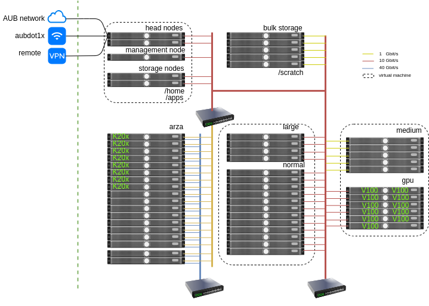

Overview
---------

Hardware Resources
==================

``Octopus`` is a mixed architecture Intel/AMD Beowulf cluster with the
following specifications:

   - 880 cores
        + 376 `AMD EPYC 7551p <https://www.amd.com/en/products/cpu/amd-epyc-7551p>`_ vCPUs
        + 96  `Intel Xeon E5-2695 v4 <https://ark.intel.com/content/www/us/en/ark/products/91316/intel-xeon-processor-e5-2695-v4-45m-cache-2-10-ghz.html>`_ vCPUs
        + 288 `Intel Xeon E5-2665 <https://ark.intel.com/products/64597/Intel-Xeon-Processor-E5-2665-20M-Cache-2_40-GHz-8_00-GTs-Intel-QPI?q=E5-2665>`_ physical cores
        + 48  `Intel Xeon E5-2643 v2 <https://ark.intel.com/content/www/us/en/ark/products/75268/intel-xeon-processor-e5-2643-v2-25m-cache-3-50-ghz.html>`_ vCPUs
        + 72   misellaneous CPUs and vCPUs for management / storage and other tasks
   - 3.0 TB main memory
   - 4 x `Nvidia V100 PCI-E <https://www.nvidia.com/en-us/data-center/v100/>`_ GPUs
   - 8 x `Nvidia GK110GL Tesla K20m <http://www.nvidia.com/content/PDF/kepler/Tesla-K20X-BD-06397-001-v05.pdf>`_ GPUs
   - 10 Gbit/s CISCO interconnect used for storage and computing
   - 40 Gbit/s Infiniband interconnect `QLogic 12200 InfiniBand QDR switch <http://filedownloads.qlogic.com/files/software/77422/Install_Guide_QLogic_12000_B.pdf>`_ switch
   - 100 TB shared storage and scratch space

Operating system
================

All the nodes of ``Octopus`` run Linux (CentOS 7).

The following types of jobs can be run on the cluster:

   - batch jobs (no user interaction)
   - GPU jobs (e.g scientific computing using GPGPUs or deep learning)
   - memory intensive jobs (up to 256GB RAM on a single machine available as a SMP host)
   - IO intensive jobs using the scratch partition (e.g several TB processing per job)
   - Interactive Jupyer jobs running on the compute hosts
   - Fully interactive desktop environment running on a compute node

Scheduler
=========

The scheduler used in ``Octopus`` is open source `SLURM <https://slurm.schedmd.com/documentation.html>`_
For more information on using the scheduler please consult the :ref:`SLURM cheatsheet <slurm_cheatsheet>`

Partitions
==========

There are three main types of partitions available for users:

  - ``normal``: 12 hosts with 16 vCPUs each with 64GB RAM
  - ``gpu``: 3 hosts with one V100 card on each node limited to 8 cores and 128 GB RAM max.
  - ``large``: 4 hosts with 64 cores each and 256 GB RAM
  - ``arza``: 16 hosts with 16 cores each and 64 GB RAM connected with Infiniband connectivity
  - ``medium``: 5 hosts with 12 cores each and 24 GB RAM

For more information on using the paritions with the information on the resources
and time limits please consult the :ref:`hosts and partitions section <hosts_and_partitions>`.

Storage
=======

All the hosts' mount the ``/home`` directory and the ``/apps`` directory. The quota
of the home directory is set to 25 GB. The ``/home`` directory is backed up regularly.
For larger storage space the ``/scratch`` partition can be used that has a quota 1 TB
per user. The maximum number of files that can be owned by a user is 1,000,000.
